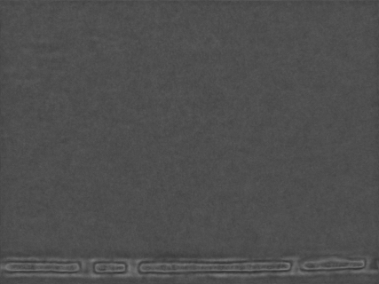
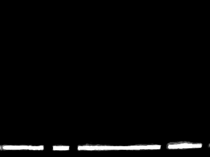
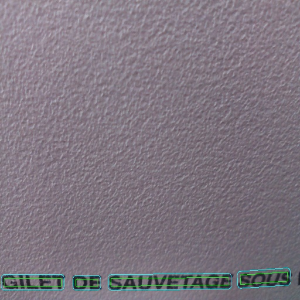
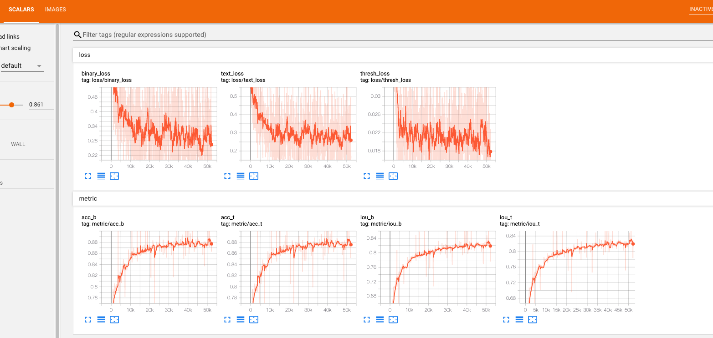
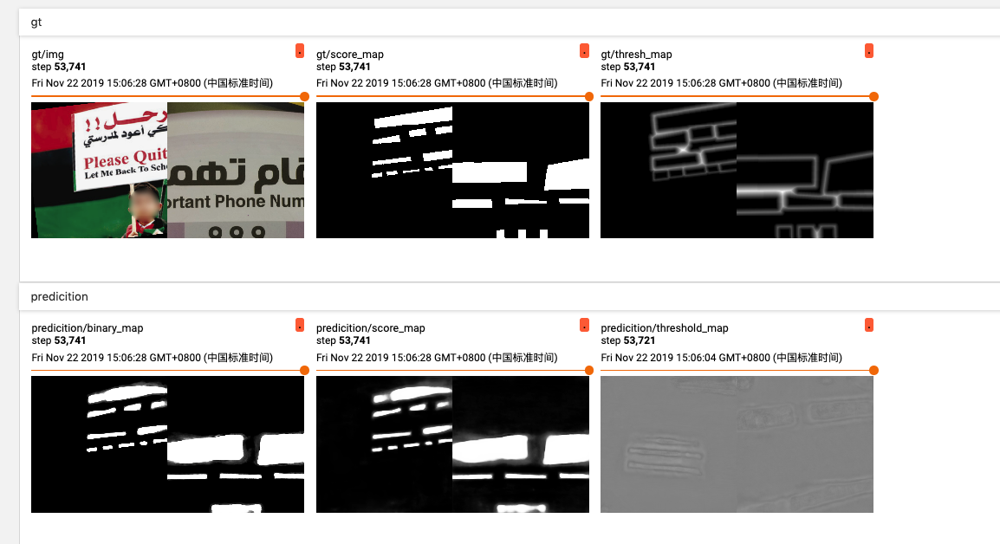

Pytorch implements Real-time Scene Text Detection with Differentiable Binarization

## Requirements
* Python 2.7
* PyTorch v0.4.1+
* pyclipper
* Polygon2
* OpenCV 4.0
* opencv-python 3.4


## Training
```
python train_ic15.py --arch resnet50 --batch_size 8 --root_dir ../../../Store/Text-Detection-Datasets/ICDAR2017-MLT/train/
```

## Inference
```
python eval.py --root_dir ../../../Store/Text-Detection-Datasets/ICDAR2017-MLT/val/ --resume checkpoints/ic15_resnet50_bs_8_ep_600/checkpoint.pth.tar --long_size 1280
```

## Visulalization


| Probability map | Threshold map | binarization map | Image |
| --------------- | ------------- | ---------------- | ----- |
|            |               |                  |       |


### Training Curve





## Reference  

[PSENet](https://github.com/whai362/PSENet)
[Real-time Scene Text Detection with Differentiable Binarization](https://arxiv.org/abs/1911.08947)